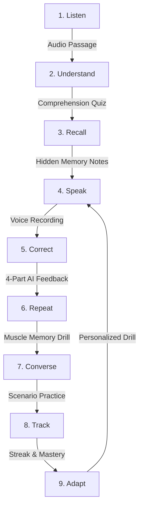

# TalkSaathi AI

> **Your AI Saathi for English Speaking**

[](https://nextjs.org/)
[](https://react.dev/)
[](https://www.typescriptlang.org/)
[](https://tailwindcss.com/)
[](./LICENSE)
[](https://hacktoberfest.com/)

**TalkSaathi AI** is an AI-powered English speaking companion designed for learners who understand English but struggle to speak it confidently. Instead of only memorizing grammar rules and vocabulary flashcards, TalkSaathi focuses on active oral recall, guided repetition, instant 4-part AI feedback, and free-flowing conversational practice.

---

## Don't just learn English. Practice speaking it.

Millions of bilingual learners—especially students and early-career developers in India—read technical documentation effortlessly, watch lectures in English, and understand every word. But the moment they unmute their microphone in an interview or stand up to give a presentation, an invisible wall appears.

TalkSaathi (*Saathi* means **companion** or **friend** in Hindi) serves as a patient, judgment-free practice partner available anytime on your desktop browser.

---

## Why TalkSaathi?

### Built for a Friend

This project was inspired by a very close friend:

> *"He understands English thoroughly. He watches English tutorials, reads textbooks, and writes clean code. But whenever he needs to speak up in a group discussion or interview, he hesitates. He thinks in Hindi first, mentally translates each sentence word-by-word, and worries about making a silly grammar mistake. By the time he crafts the 'perfect sentence' in his head, the conversation has moved on."*

The root problem is not a lack of English knowledge. **The real problem is the lack of a consistent, safe space for daily speaking practice.**

Traditional classroom apps test reading and vocabulary matching. But **speaking is a motor skill and a habit.** To overcome translation friction, learners need a companion that listens, gently explains mistakes in friendly Hinglish/English, and prompts them to repeat the corrected sentence aloud immediately to train oral muscle memory.

---

## How TalkSaathi Works

TalkSaathi guides learners through a proven 9-stage active learning cycle:



1. **Listen**: Hear natural, idiomatic conversational English spoken at controlled speeds (0.8x, 1.0x, 1.25x).
2. **Understand**: Check listening comprehension without translating word-for-word.
3. **Recall**: Synthesize what was heard from memory (transcript hidden) via voice or text.
4. **Speak**: Answer a situational challenge prompt using the browser microphone.
5. **Correct**: Receive instant 4-part AI feedback highlighting translation friction.
6. **Repeat**: Speak the corrected sentence aloud into the mic to build tongue muscle memory.
7. **Converse**: Apply skills in simulated real-world scenarios (interviews, campus, travel).
8. **Track**: Monitor habit streaks, weak areas, and grammar patterns.
9. **Adapt**: Tomorrow's practice automatically emphasizes your most frequent stumbling blocks.

---

## Current Features

The following capabilities are implemented and fully functional in the current MVP:

- 🎯 **No-Login Onboarding & Placement Diagnostic**:
  - Calibrates learner level (**Beginner** / **Intermediate**) through a diagnostic test.
  - Customizes goals, daily practice time (10, 15, 20, or 30 minutes), and explanation language (**English**, **Hindi**, or **Hinglish**).
  - Stores state locally via versioned LocalStorage keys (`talksaathi:v1`).

- 📊 **Personalized Practice Dashboard**:
  - Dynamic time-aware greeting and daily habit streak tracker.
  - "Today's Practice" hero card targeting specific weak areas (e.g., past tense errors like *"didn't went"*).
  - Quick skill mastery progress indicators (Speaking, Listening, Grammar, Vocabulary).

- 🔄 **8-Stage Daily Practice Experience (`/practice`)**:
  - Structured practice session generator adapting to 10, 15, 20, or 30-minute durations.
  - Interactive quiz verification, oral recall, microphone challenge, and celebration summary.

- 🎙️ **Voice Recording & Ephemeral STT (`VoiceRecorder`)**:
  - Complete 5-state recording machine: `idle` → `listening` → `processing` → `success` → `error`.
  - In-browser microphone permission detection and live timer.
  - Integrated with server route `POST /api/voice/stt` using ElevenLabs Scribe with automatic development fallback.

- 🔊 **Neural Speech Playback (`AudioPlayer`)**:
  - Multi-speed playback: **Slow (0.8x)**, **Normal (1.0x)**, and **Fast (1.25x)**.
  - Play, pause, replay scrubber with elapsed and total duration timers.
  - Integrated with server route `POST /api/voice/tts` using ElevenLabs neural audio streaming with browser Web Speech synthesis fallback.

- 🤖 **4-Part AI Grammar Correction Engine**:
  - Powered by open-weight LLM inference (`POST /api/ai/correct` with Qwen models).
  - Structured 4-part breakdown:
    1. **What You Said** (student's raw spoken text)
    2. **Grammatically Correct English** (with listen audio button)
    3. **Why?** (concise explanation of Hindi-to-English grammar friction)
    4. **Native Conversational Version** (idiomatic phrasing used by fluent speakers)

- 💬 **Conversation Scenarios (`/conversation`)**:
  - Practice dialogues for Job Interviews, College Life, Social Travel, and Tech Presentations.
  - Integrated voice playback for AI mentor responses.

- 📖 **Indian English Common Phrases & Nuances (`/phrases`)**:
  - Categorized guide translating literal Indian idioms into natural global English (e.g., *"prepone"*, *"pass out from college"*, *"revert back"*).

---

## System Architecture

```
Browser Client (Microphone & Speakers)
               │
               ▼
┌──────────────────────────────────────────────┐
│             TalkSaathi UI Layer              │
│  - Next.js 16 (Turbopack) & React 19         │
│  - Soft Purple & Lavender Design Tokens      │
│  - LocalStorage Versioned Store (talksaathi) │
│  - Reusable VoiceRecorder & AudioPlayer      │
└──────────────────────┬───────────────────────┘
                       │
                       ▼
┌──────────────────────────────────────────────┐
│        Next.js Server API Routes             │
│  - POST /api/ai/correct   (Open-Weight LLM)  │
│  - POST /api/voice/stt    (ElevenLabs STT)   │
│  - POST /api/voice/tts    (ElevenLabs TTS)   │
│  * Ephemeral in-memory audio buffers only    │
│  * Zero disk/cloud audio storage             │
└──────────────┬────────────────┬──────────────┘
               │                │
               ▼                ▼
┌──────────────────────┐ ┌──────────────────────┐
│  Open-Weight Brain   │ │   Voice Pipeline     │
│  - Qwen/Qwen2.5-7B   │ │  - ElevenLabs Scribe │
│  - Structured JSON   │ │  - ElevenLabs Audio  │
│  - Hinglish Support  │ │  - Web Speech Engine │
└──────────────────────┘ └──────────────────────┘
```

For complete technical specifications, see [`docs/ARCHITECTURE.md`](./docs/ARCHITECTURE.md).

---

## Privacy & Security Guarantees

- **No Authentication Required**: Practice begins immediately without collecting passwords, emails, or personal identifiers.
- **Ephemeral Audio Processing**: Voice recordings are converted to in-memory buffers for transcription and are **never saved** to disk, cloud buckets, or databases.
- **Server-Side API Isolation**: External API keys (`ELEVENLABS_API_KEY`, `HF_TOKEN`) are strictly kept on the server and are never exposed to client-side code.

---

## Tech Stack

- **Framework**: Next.js 16.3 (App Router with Turbopack)
- **UI Library**: React 19, Tailwind CSS v4, Lucide Icons
- **AI Brain**: Open-Weight LLMs (Qwen/Qwen2.5-7B-Instruct via Hugging Face Inference API)
- **Voice Pipeline**: ElevenLabs Scribe STT & ElevenLabs Neural TTS (with browser Web Speech fallback)
- **State Management**: Local-First with React `useSyncExternalStore` and versioned LocalStorage

---

## Getting Started

### Prerequisites

- **Node.js**: `v20.x` or `v22.x` recommended
- **npm** or **pnpm** / **yarn**

### Installation

1. **Clone the repository:**
   ```bash
   git clone https://github.com/Rishabh-KSingh/TalkSaathi-AI.git
   cd TalkSaathi-AI
   ```

2. **Install dependencies:**
   ```bash
   npm install
   ```

3. **Configure Environment Variables:**
   ```bash
   cp .env.example .env.local
   ```

   *(Optional)* Add your API credentials to `.env.local` to enable live external services:
   ```env
   # ElevenLabs Voice Integration (STT & TTS)
   ELEVENLABS_API_KEY=your_elevenlabs_key_here
   ELEVENLABS_VOICE_ID=21m00Tcm4TlvDq8ikWAM

   # Open-Weight LLM Brain
   HF_TOKEN=your_huggingface_token_here
   HF_MODEL=Qwen/Qwen2.5-7B-Instruct

   # Mode: "live" for production APIs, "mock" for zero-credential local testing
   AI_PROVIDER_MODE=mock
   ```

   > **Note**: TalkSaathi AI works out-of-the-box with `AI_PROVIDER_MODE=mock`. If no keys are provided, it seamlessly uses deterministic local grammar responses and browser speech synthesis.

4. **Run the development server:**
   ```bash
   npm run dev
   ```

5. **Open in browser:**
   Navigate to [http://localhost:3000](http://localhost:3000) to start practicing.

---

## Project Structure

```
TalkSaathi_AI/
├── app/                        # Next.js App Router
│   ├── api/                    # Server-side API endpoints
│   │   ├── ai/correct/         # Open-weight grammar correction route
│   │   └── voice/              # STT & TTS voice endpoints
│   ├── conversation/           # Free conversation scenarios
│   ├── onboarding/             # Diagnostic placement wizard
│   ├── phrases/                # Common Indian-English nuance guide
│   ├── practice/               # 8-stage daily practice loop
│   ├── progress/               # Mastery & habit tracking
│   ├── settings/               # User preferences & data reset
│   ├── layout.tsx              # Root HTML shell & fonts
│   └── page.tsx                # Main personalized dashboard
├── components/                 # Reusable UI & Voice components
│   ├── layout/                 # AppShell, Sidebar, Header
│   ├── ui/                     # Button, Card, Badge, Input
│   └── voice/                  # VoiceRecorder & AudioPlayer
├── docs/                       # Architectural & design documentation
│   └── ARCHITECTURE.md         # Detailed system design
├── lib/                        # Business logic & SDK clients
│   ├── ai/                     # Qwen open-weight LLM client & prompts
│   ├── elevenlabs/             # ElevenLabs STT & TTS client
│   ├── onboarding/             # Placement test questions & calibration
│   ├── practice/               # Daily practice curriculum plans
│   └── storage/                # Local-first storage adapter
├── types/                      # TypeScript domain models
├── .env.example                # Safe environment variable template
├── LICENSE                     # MIT Open Source License
└── package.json                # Project dependencies & scripts
```

---

## Quality & Build Verification

Run linting and production build verification locally:

```bash
# Verify code formatting and TypeScript rules
npm run lint

# Compile production bundle with Next.js Turbopack
npm run build
```

---

## Roadmap

The following enhancements are planned for subsequent iterations:

- [ ] **Phoneme-Level Acoustic Scoring**: Waveform and acoustic alignment for fine-grained pronunciation feedback.
- [ ] **Live Full-Duplex Voice Streaming**: Real-time voice turn-taking with open-weight conversational models.
- [ ] **Camera Textbook OCR**: Instant scan-and-practice for school and college English textbook excerpts.
- [ ] **Gemma 2 Fine-Tuned Brain**: Model fine-tuned specifically on Indic English bilingual code-switching patterns.
- [ ] **Cloud Backup & Study Guilds**: Optional encrypted progress sync and community speaking rooms.

---

## Hackathon Context

This project was built for the **Hacktoberfest Weekend Challenge — Build for a Friend** on the DEV Community platform. It addresses the real-world communication anxiety experienced by friends and peers who understand English well academically but need an encouraging companion to practice speaking out loud.

---

## License

This project is licensed under the [MIT License](./LICENSE) — feel free to use, modify, and build upon it.
