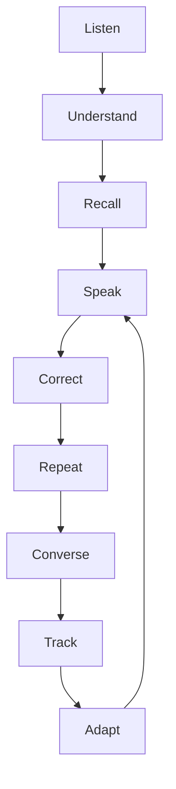

# TalkSaathi AI

> Your AI Saathi for English Speaking

TalkSaathi AI is an AI-powered English speaking companion designed for learners who understand English but struggle to speak it confidently. Instead of only teaching grammar rules and vocabulary flashcards, TalkSaathi focuses on repeated speaking practice, instant 4-part correction, conversational drills, and personalized improvement.

[](https://nextjs.org/)
[](https://www.typescriptlang.org/)
[](./LICENSE)
[](https://hacktoberfest.com/)

---

## Don't just learn English. Practice speaking it.

Millions of learners—especially bilingual students and developers—can read technical documentation effortlessly, follow English videos with ease, and understand every word. Yet the moment they speak in an interview, standup, or group discussion, an invisible barrier appears.

Common everyday hurdles:
- **Thinking in Hindi first** before uttering a sentence in English
- **Mentally translating sentences** word-by-word under conversational time pressure
- **Fear of making grammar slips** (such as *"didn't went"* or missing prepositions)
- **Difficulty forming natural phrasing** quickly
- **Limited real-world speaking opportunities** in daily routines
- **Absence of a patient, judgment-free practice partner** who listens without criticism

TalkSaathi (*Saathi* means **companion** or **friend** in Hindi) was created to bridge this exact gap: providing a safe, encouraging space where learners can practice speaking aloud every day.

---

## Why TalkSaathi?

### Built for a Friend

This project was born out of a real observation of a close friend:

> *A friend understands English.*  
> *They can read English.*  
> *They can watch English videos.*  
> *They know English words.*  
>  
> *But when they have to speak:*  
> *They pause.*  
> *They think in Hindi.*  
> *They translate mentally.*  
> *They worry about grammar.*  
>  
> *Sometimes they know what they want to say, but cannot say it naturally.*

The fundamental challenge is not a lack of English comprehension or vocabulary content. **The real problem is the lack of consistent, active speaking practice.**

Speaking is an oral motor skill and a confidence reflex. To break the habit of mental translation, learners need continuous conversational reps: speaking into a microphone, receiving clear explanations for why a phrase sounds unnatural, and immediately repeating the polished version aloud to build muscle memory.

---

## How TalkSaathi Works

TalkSaathi guides learners through a proven interactive learning loop:



| Stage | Action | Pedagogical Objective |
| :--- | :--- | :--- |
| **1. Listen** | Audio passage at selectable speeds (0.8x, 1.0x, 1.25x) | Trains ear to natural conversational cadences and phrasing |
| **2. Understand** | Quick multiple-choice comprehension check | Validates understanding without relying on literal word translation |
| **3. Recall** | Oral or text recall with original transcript hidden | Encourages active memory retrieval instead of passive reading |
| **4. Speak** | Microphone response to a situational challenge prompt | Overcomes initial reluctance by practicing oral delivery |
| **5. Correct** | 4-part structured AI feedback | Pinpoints exact Hindi-to-English translation friction |
| **6. Repeat** | Verbal repetition of the corrected, natural sentence | Drills speech muscle memory to replace faulty habits |
| **7. Converse** | Roleplay scenarios (interviews, campus, travel, tech) | Transfers drilled patterns to spontaneous conversation |
| **8. Track** | Streaks, accuracy metrics, and mistake patterns | Reinforces consistency and measures tangible progress |
| **9. Adapt** | Intelligent session curation | Automatically tailors tomorrow's drill to frequent stumbling blocks |

---

## Current Features

The following features are implemented and active in the repository:

- 🎯 **No-Login Onboarding & Diagnostic Placement (`/onboarding`)**:
  - Calibrates initial learner level (**Beginner** or **Intermediate**) via a diagnostic check.
  - Personalizes daily target duration (10, 15, 20, or 30 minutes) and preferred explanation language (**English**, **Hindi**, or **Hinglish**).
  - Stores preferences locally in the browser (`talksaathi:v1`) with zero login friction.

- 📊 **Personalized Daily Dashboard (`/`)**:
  - Time-aware greetings and habit streak counter.
  - "Today's Practice" hero card targeting specific recorded weak areas (e.g., past tense errors like *"didn't went"*).
  - Skill mastery indicators across Speaking, Listening, Grammar, and Vocabulary.

- 🔄 **Structured Daily Practice Experience (`/practice`)**:
  - Complete multi-stage practice workflow tailored to selected session length.
  - Interactive comprehension check, memory recall step, voice prompt challenge, 4-part correction review, and tongue-memory repetition.

- 🎙️ **Microphone Voice Recording (`VoiceRecorder`)**:
  - In-browser microphone audio capture with state handling (`idle` → `listening` → `processing` → `success` → `error`).
  - Visual recording timer and live feedback.
  - Connected to server transcription route with automatic fallback mode for testing without external keys.

- 🔊 **Multi-Speed Audio Playback (`AudioPlayer`)**:
  - Speed adjustments: **Slow (0.8x)**, **Normal (1.0x)**, and **Fast (1.25x)**.
  - Scrubber with elapsed time and replay capabilities.
  - Server audio synthesis integration with browser speech synthesis fallback.

- 🤖 **4-Part AI Grammar Correction Engine (`POST /api/ai/correct`)**:
  - Evaluates spoken English and returns a structured 4-part evaluation:
    1. **What You Said** — exact learner transcript
    2. **Grammatically Correct English** — accurate version with audio playback
    3. **Why?** — clear, friendly explanation of grammar rules in the learner's chosen language (English, Hindi, or Hinglish)
    4. **Native Conversational Version** — natural phrasing used by fluent native speakers

- 💬 **Interactive Conversation Scenarios (`/conversation`)**:
  - Dialogue simulations for Job Interviews, College Life, Social Travel, and Technical Presentations.
  - Integrated audio playback to hear natural mentor prompts aloud.

- 📖 **Indian English Phrase Vault (`/phrases`)**:
  - Curated glossary explaining common literal translations (e.g., *"prepone"*, *"pass out of college"*, *"revert back"*) alongside their global English equivalents.
  - Built-in audio playback and direct link to spoken practice.

- 📈 **Mistake Memory & Progress Tracker (`/progress`)**:
  - Tracks streak count, points (XP), and daily speaking confidence ratings.
  - Maintains a ledger of repeated grammar patterns to guide subsequent practice sessions.

---

## System Architecture

```
User (Browser Microphone & Speakers)
               │
               ▼
┌──────────────────────────────────────────────┐
│             TalkSaathi UI Layer              │
│  - Next.js 16 (App Router) & React 19        │
│  - Soft purple & lavender design language    │
│  - Local-first state (LocalStorage v1)       │
│  - Reusable VoiceRecorder & AudioPlayer      │
└──────────────────────┬───────────────────────┘
                       │
                       ▼
┌──────────────────────────────────────────────┐
│        Next.js Server API Routes             │
│  - POST /api/ai/correct   (Open-Weight LLM)  │
│  - POST /api/voice/stt    (ElevenLabs STT)   │
│  - POST /api/voice/tts    (ElevenLabs TTS)   │
│  * Ephemeral in-memory audio processing      │
│  * Strict server-side secret isolation       │
└──────────────┬────────────────┬──────────────┘
               │                │
               ▼                ▼
┌──────────────────────┐ ┌──────────────────────┐
│  Open-Weight Brain   │ │   Voice Pipeline     │
│  - Qwen/Qwen2.5-7B   │ │  - ElevenLabs STT    │
│  - Structured JSON   │ │  - ElevenLabs TTS    │
│  - Hinglish Support  │ │  - Web Speech Fallback│
└──────────────────────┘ └──────────────────────┘
```

For complete technical specifications, see [`docs/ARCHITECTURE.md`](./docs/ARCHITECTURE.md).

---

## Privacy & Security Guarantees

- **No Authentication Required**: Practice begins immediately without collecting passwords, emails, or personal data.
- **Ephemeral Audio Processing**: Microphone audio is processed in memory during transcription and is **never written to disk or third-party storage buckets**.
- **Server-Side API Key Isolation**: External API tokens (`ELEVENLABS_API_KEY`, `HF_TOKEN`) are strictly kept on the server side and never leaked to the client browser.

---

## Tech Stack

| Category | Technologies |
| :--- | :--- |
| **Framework** | Next.js 16.3 (App Router with Turbopack) |
| **Frontend UI** | React 19, Tailwind CSS v4, Lucide React |
| **AI Evaluation** | Open-Weight LLMs (Qwen/Qwen2.5-7B-Instruct via Hugging Face Inference API) |
| **Voice Pipeline** | ElevenLabs Scribe STT & Neural TTS (with browser Web Speech fallback) |
| **State & Storage** | Local-First with React `useSyncExternalStore` and versioned LocalStorage |

---

## Getting Started

### Prerequisites

- **Node.js**: `v20.x` or higher
- **npm** (or `pnpm` / `yarn`)

### Installation & Run

1. **Clone the repository:**
   ```bash
   git clone https://github.com/Rishabh-KSingh/TalkSaathi-AI.git
   cd TalkSaathi-AI
   ```

2. **Install dependencies:**
   ```bash
   npm install
   ```

3. **Configure Environment Variables:**
   ```bash
   cp .env.example .env.local
   ```

   *(Optional)* Configure your keys in `.env.local` to enable external production services:
   ```env
   # ElevenLabs Voice Integration (STT & TTS)
   ELEVENLABS_API_KEY=your_elevenlabs_key_here
   ELEVENLABS_VOICE_ID=21m00Tcm4TlvDq8ikWAM

   # Open-Weight LLM Brain
   HF_TOKEN=your_huggingface_token_here
   HF_MODEL=Qwen/Qwen2.5-7B-Instruct

   # Provider Mode: "live" for production APIs, "mock" for zero-credential local testing
   AI_PROVIDER_MODE=mock
   ```

   > **Note**: TalkSaathi AI works completely out-of-the-box in `AI_PROVIDER_MODE=mock` without any paid API keys. It uses deterministic grammar evaluations and browser speech synthesis so you can test the full experience immediately.

4. **Start the development server:**
   ```bash
   npm run dev
   ```

5. **Open in browser:**
   Visit [http://localhost:3000](http://localhost:3000) to start practicing.

---

## Project Structure

```
TalkSaathi-AI/
├── app/                        # Next.js App Router pages and API routes
│   ├── api/                    # Server-side API endpoints
│   │   ├── ai/correct/         # Open-weight grammar correction route
│   │   └── voice/              # Ephemeral STT and TTS voice routes
│   ├── conversation/           # Guided conversation scenarios
│   ├── onboarding/             # Diagnostic placement wizard
│   ├── phrases/                # Common Indian-English nuance guide
│   ├── practice/               # Multi-stage daily practice loop
│   ├── progress/               # Habit tracking & mistake ledger
│   ├── settings/               # Preferences & client state management
│   ├── layout.tsx              # Root HTML shell & typography
│   └── page.tsx                # Main personalized practice dashboard
├── components/                 # Reusable React components
│   ├── dashboard/              # Hero card, streak card, skill grid
│   ├── layout/                 # AppShell, Sidebar, Header
│   ├── ui/                     # Button, Card, Badge, Input primitives
│   └── voice/                  # VoiceRecorder & AudioPlayer components
├── docs/                       # Architecture & design specifications
│   └── ARCHITECTURE.md         # In-depth system documentation
├── lib/                        # Core utilities and business logic
│   ├── ai/                     # Open-weight inference client & prompts
│   ├── elevenlabs/             # Voice transcription and synthesis client
│   ├── onboarding/             # Placement diagnostic data
│   ├── practice/               # Curriculum generation logic
│   └── storage/                # LocalStorage state management
├── types/                      # TypeScript domain definitions
├── .env.example                # Safe environment variable template
├── LICENSE                     # MIT Open Source License
└── package.json                # Project dependencies and scripts
```

---

## Code Quality & Verification

Verify formatting, lint rules, and production build locally:

```bash
# Check code style and TypeScript correctness
npm run lint

# Validate optimized production bundle compilation
npm run build
```

---

## Roadmap

Planned capabilities for upcoming releases:

- [ ] **Phoneme-Level Acoustic Scoring**: Waveform visualization and fine-grained pronunciation scoring.
- [ ] **Full-Duplex Voice Streaming**: Real-time voice turn-taking with open-weight conversational models.
- [ ] **Photo & Textbook OCR**: Scan handwritten notes or English textbook excerpts to generate spoken drills.
- [ ] **Fine-Tuned Indic ESL Model**: Custom fine-tuning on bilingual Indian English speech patterns and code-switching.
- [ ] **Optional Cloud Sync & Study Rooms**: Encrypted cross-device backup and peer speaking practice rooms.

---

## Hackathon Context

This project was created for the **Hacktoberfest Weekend Challenge — Build for a Friend** on the DEV Community platform. It is dedicated to friends and peers who understand English well academically but need an encouraging companion to practice speaking out loud.

---

## License

This project is licensed under the [MIT License](./LICENSE).
