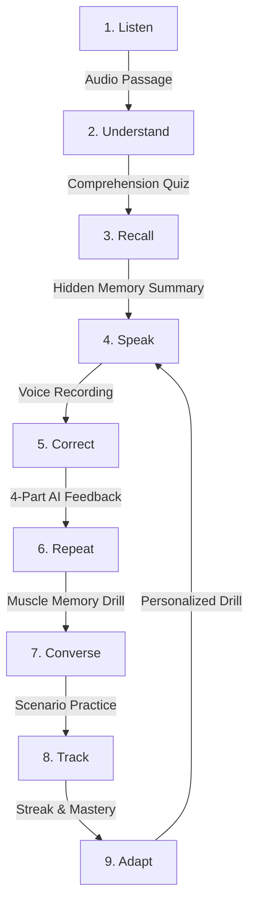

# TalkSaathi AI — Architecture & System Design

TalkSaathi AI is built on a privacy-first, modular architecture designed to train spoken English fluency through an interactive learning loop. This document outlines the system architecture, component boundaries, data flow, and current implementation status.

---

## 1. System Overview

```
User (Browser Microphone & Speakers)
               │
               ▼
┌──────────────────────────────────────────────┐
│             TalkSaathi UI Layer              │
│  - Desktop-First Responsive Shell (Next.js)  │
│  - No-Login Placement & Onboarding Flow      │
│  - 8-Stage Daily Practice State Machine      │
│  - Reusable VoiceRecorder & AudioPlayer      │
│  - LocalStorage Versioned Store (v1)         │
└──────────────────────┬───────────────────────┘
                       │
                       ▼
┌──────────────────────────────────────────────┐
│        Next.js Server API Routes             │
│  - POST /api/ai/correct   (Open-Weight LLM)  │
│  - POST /api/voice/stt    (ElevenLabs Scribe)│
│  - POST /api/voice/tts    (ElevenLabs Audio) │
│  * Ephemeral in-memory audio buffers only    │
│  * Secrets strictly kept server-side         │
└──────────────┬────────────────┬──────────────┘
               │                │
               ▼                ▼
┌──────────────────────┐ ┌──────────────────────┐
│  Open-Weight Brain   │ │   Voice Pipeline     │
│  - Qwen/Qwen2.5-7B   │ │  - ElevenLabs STT    │
│  - Structured JSON   │ │  - ElevenLabs TTS    │
│  - Hinglish Support  │ │  - Web Speech Fallback│
└──────────────────────┘ └──────────────────────┘
```

---

## 2. Core Learning Loop

The application implements a pedagogical cycle designed to eliminate Hindi-to-English translation friction:



---

## 3. Privacy-First Principles

1. **No-Login Local-First Storage**: User profile, placement test calibration, and mistake records are stored entirely on the client side using versioned LocalStorage keys (`talksaathi:v1`).
2. **Ephemeral Voice Processing**: Audio recorded in the browser is streamed as in-memory buffers to server routes (`POST /api/voice/stt` and `POST /api/voice/tts`). Raw audio is **never** permanently written to local disks, cloud object buckets, or databases.
3. **Server-Side Secret Isolation**: All API tokens (`ELEVENLABS_API_KEY`, `HF_TOKEN`) reside strictly in server environments and are never bundled into client payloads.

---

## 4. Implementation Status Matrix

### Currently Implemented & Working

| Component / Layer | Technology | Status | Notes |
| :--- | :--- | :--- | :--- |
| **Frontend Shell** | Next.js 16, React 19, Tailwind CSS | **Production-Ready** | Soft purple/lavender tokens, responsive desktop-first layout |
| **Onboarding & Placement** | Client State Machine, LocalStorage | **Production-Ready** | 4-question diagnostic quiz, level assignment, no login required |
| **Daily Practice Engine** | 8-Stage Interactive State Machine | **Production-Ready** | 10/15/20/30m dynamic plans targeting user's specific weak area |
| **Voice Recording (STT)** | `VoiceRecorder` Component + Scribe STT | **Working with Fallback** | 5-state machine, mic permissions, real-time timer, in-memory upload |
| **Voice Synthesis (TTS)** | `AudioPlayer` Component + ElevenLabs | **Working with Fallback** | Slow/Normal/Fast speed rates, play/pause/replay, browser fallback |
| **AI Grammar Correction** | `POST /api/ai/correct` + Qwen Client | **Working with Fallback** | 4-part structured JSON: original, corrected, why, natural phrasing |
| **Phrase Book** | Categorized Indian-English Glossary | **Production-Ready** | Instant search & category filtering for common translation slips |
| **Progress Tracker** | Habit Streak & Mistake Ledger | **Production-Ready** | Displays accuracy, streak retention, and targeted weak-area focus |

### Planned & Upcoming (Roadmap)

| Feature | Target Layer | Description |
| :--- | :--- | :--- |
| **Phoneme Acoustic Scoring** | Voice Layer | Waveform and phoneme-level acoustic scoring for pronunciation precision |
| **Real-Time Streaming Voice** | WebRTC / WebSocket | Ultra-low latency voice conversational duplexing with TalkSaathi |
| **Gemma 2 Fine-Tuned Brain** | AI Layer | Specialized fine-tuned open-weight model for Indic bilingual ESL learners |
| **Camera Textbook OCR** | Vision Layer | Snapshot scanner for school/college English textbooks and exam prompts |
| **Cloud Sync & Guilds** | Persistence Layer | Optional encrypted cloud synchronization and peer study rooms |
